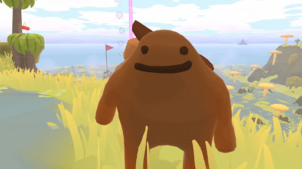
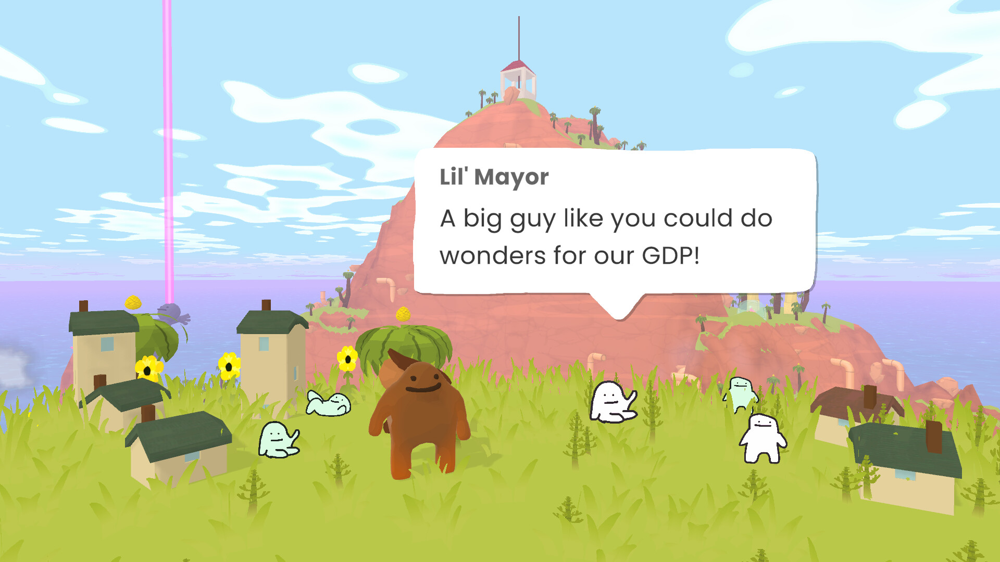
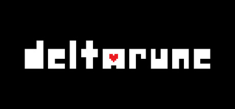
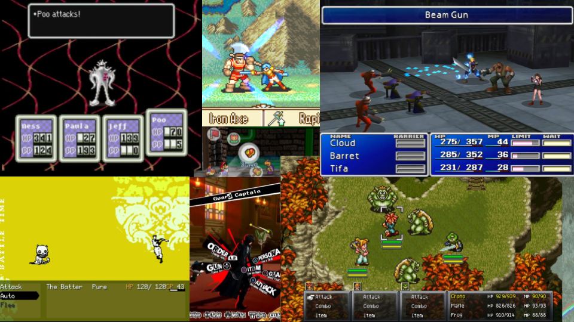
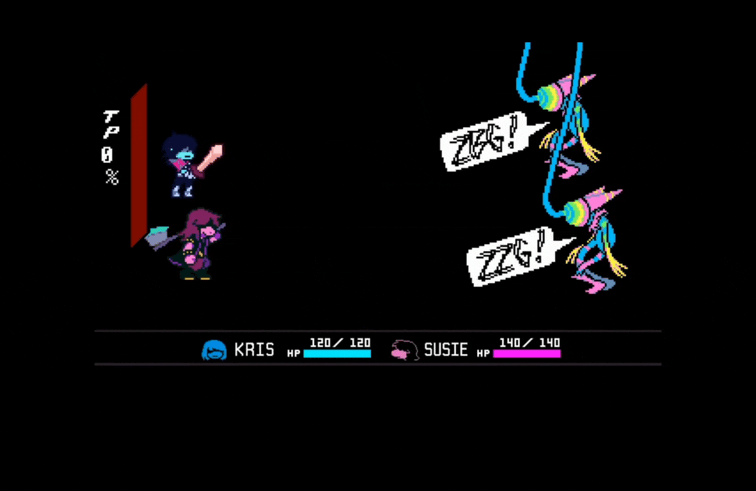

+++
title = "3 lil Indie Games That You Should Play to Live a Good Life"
author = "Micah Bird"
date = "2026-04-16"
categories = [
    "Games"
]
image = "cover.jpg"
+++
*This blog post is adapted from a presentation I gave for HASS 465: THE GOOD LIFE, FROM ARISTOTLE TO THE ANTHROPOCENE.*

---

This first game is all about exploration, climbing every mountain, looking in every corner, and going on a grandiose adventure... But who do you play as? Well, this little fella of course:

The name of the first game is is **Tall Trails**, and your objective is to find your purpose in the world. 

Why do I like it? The best thing I can equate it to is like if The Legend of Zelda Breath of the Wild was more whimsical. You go around just climbing and collecting things to progress to new worlds. You know, typically video game things. It also has a chill atmosphere, with a neat gimmick!



The main gimmick of this game is that you have a boot that is permanently stuck to your back, and you can put different items in it to get different abilities! The best thing I can equate it to is like the "copy abilities" in the Kirby franchise.

Finally, the comedy on this game is pretty on the nose. [Check out Tall Trails on Steam!](https://store.steampowered.com/app/2393760/Tall_Trails/)

---

But what if you are interested in something more action oriented?

Look no further than **DELTARUNE**!!

First off, I must admit, iiiiiiiiiiiiit's an RPG...

_**BUT WAIT WAIT!**_ Before you groan, this one is different.

Unlike all those lame RPGs where you press a button, wait for an attack, and then some random amount of damage occurs, in Deltarune, it's _your fault_ if you take damage:

So, why do I like it? To put it simply:

- The The 1st two chapters are free! Each chapter is exponentially better than the last, but I must admit, the 1st chapter can kinda be a slog.

- The soundtrack is a certified hood classic. Genuinely some of my favorite music of all time.

- You do not have to fight your enemies! You have the choice to either spare or fight your enemies, and there are different endings depending on how much of a pacifist or murderer you are!

I want to keep it brief to avoid spoilers, but the more blind you can go in, the better. [Check out DELTATUNE on Steam!](https://store.steampowered.com/app/1671210/DELTARUNE/) It's also on Switch and PlayStation!

---

Finally, last but not least, you should check out OneShot.

Your objective in this game is to restore light (_or maybe not?_) to a world plunged into darkness.



Why I like it:

- You 🫵, the player, play a role in the game. As a result, the game will constantly breaks the 4th wall in interesting ways.

- There is a neat mechanic where you can combine items to solve puzzles in ways you would not expect.

- It's also a great walking simulator with a gripping story.

The puzzles can be a tad confusing at times, and this game is absolutely best played in one sitting (so you can remember where you are at). OneShot has released on pretty much every platform under the sun, but you can [check it out Steam here!](https://store.steampowered.com/app/2915460/OneShot_World_Machine_Edition/) 
