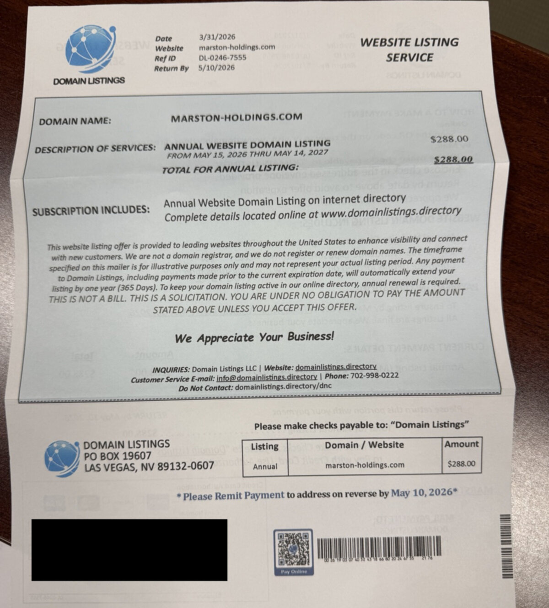
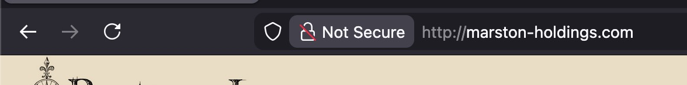
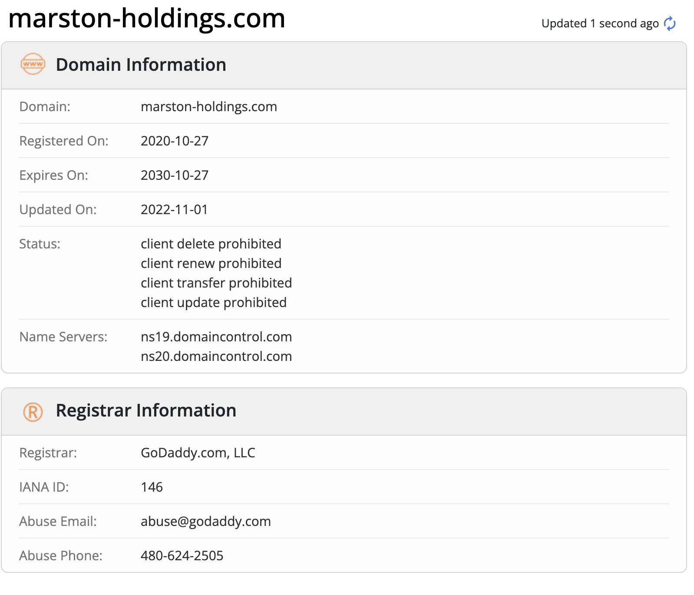
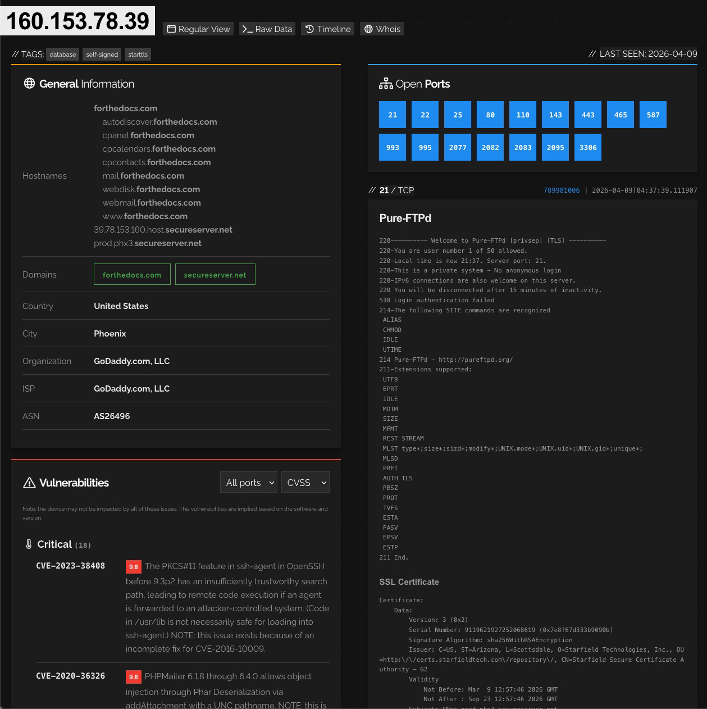
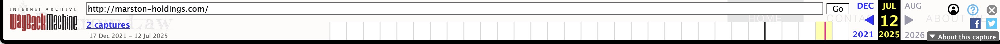

+++
title = "A Novel Kind of Domain Scam"
author = "Micah Bird"
date = "2026-04-09"
categories = [
    "InfoSec"
]
image = "cover.jpg"
+++

## The Scam

Today out of the blue I was contacted by a business that I made a website for ages ago. They simply sent a picture of the following letter they received in the mail and asked if they should do anything about it. Here is that picture:



It looks like some "professional" bill, but something is off. What the heck is the domain `marston-holdings.com` and why would they want $288 for it?! Well, when going to that site, it displays the homepage for the business who received this letter. Also, the letter is from "Domain Listings" how could it not be legit??



Well, this is going to come as a real shocker, but this is a phishing scam. This business has nothing to do with that domain, let alone hosting a clone of their homepage!

From the outside, this is how I believe the scam works:

1. Get a cheap domain.
2. Host a mirror of a website through that domain.
3. Send out scary letters that could be plausible that you need to pay for it.

It is a clever scam I must admit, but incredibly poor execution. No doubt it would have tricked the employees in this business as admittedly they are the older, and in non-technical crowd. I am incredibly thankful that they reached out to me before doing anything about it. Now, it's my turn.

## Let's Get It

First, I started with an obligatory whois lookup:



Which, unfortunately, does not tell much, besides it being registered through GoDaddy... More on them later.

Onto a `dig` to see what's under the hood.

```
$ dig marston-holdings.com

; <<>> DiG 9.10.6 <<>> marston-holdings.com
;; global options: +cmd
;; Got answer:
;; ->>HEADER<<- opcode: QUERY, status: NOERROR, id: 18973
;; flags: qr rd ra; QUERY: 1, ANSWER: 1, AUTHORITY: 0, ADDITIONAL: 1

;; OPT PSEUDOSECTION:
; EDNS: version: 0, flags:; udp: 1220
;; QUESTION SECTION:
;marston-holdings.com.		IN	A

;; ANSWER SECTION:
marston-holdings.com.	600	IN	A	160.153.78.39

;; Query time: 55 msec
;; SERVER: 172.16.0.1#53(172.16.0.1)
;; WHEN: Thu Apr 09 17:56:58 MDT 2026
;; MSG SIZE  rcvd: 65
```

Wow, a single IP? How brave.

Taking that IP to good ol' [shodan](https://www.shodan.io) is pretty revealing.



Quite a few vulnerabilities, and a fair amount of open ports too. Seems to be associated with a few other suspect domains, such as `forthedocs.com`. Which reminds me, the scam site did not even have HTTPs certs! *For shame...* But that got me wondering, how long has this site been cloned?



Huh, that's odd. The website was at least cloned starting in July 2025, and the business who is being impersonated did not receive a letter until today. Not sure if this was premeditated or if the scammers are just lazy.

## The End..?

For now, I have contacted GoDaddy support to get the impostor site taken down, but I have yet to hear back. I will update this post with new developments as they happen.
