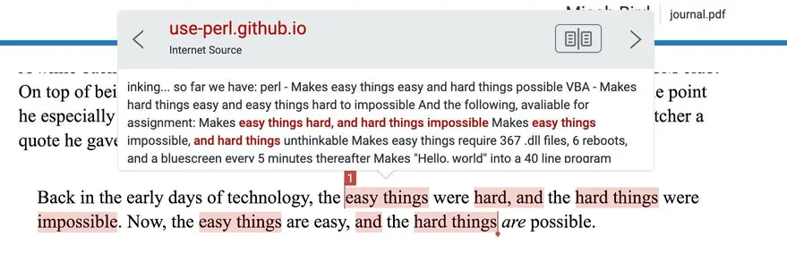

+++
title = "An Ode to Tailscale"
author = "Micah Bird"
date = "2026-05-14"
categories = [
    "Networking"
]
image = "cover.webp"
+++

# A bit of context

A while back, the CEO of Tailscale, Avery Pennarun, gave a tech talk to the Mines ACM club. On top of being incredibly star struck, this talk was truly awe-inspiring. There was one point he especially stressed that continues to echo in my head. I am going to horrifically butcher a quote he gave, but it was something to the effect of:

> Back in the early days of technology, the easy things were hard, and the hard things were impossible. Now, the easy things are easy, and the hard things *are* possible.

> But, we are losing the spirit of "easy things are easy"...

*Funny side note, I submitted that first quote in a humanities paper, and it got flagged for plagiarism from [a document in the use Perl docs](https://use-perl.github.io/user/osfameron/journal/5267/) that I was entirely unaware of. Go figure.*

Avery gave an example of setting up an inventory system for a bookstore. In the early days of computing you would just load some spreadsheet software on a single computer and call it a day. You would not need to worry about hackers, or internet access or the like, as it's an isolated system.

Nowadays the easy things aren't so easy anymore. Taking that same example for a bookstore, you would now have to worry about security updates, scalability, and most important of all: networking.
 
The following is a short story of how [Tailscale](https://tailscale.com/) made things easy.

# A Short Story

Whenever I am on breaks from school, I frequently travel to visit family to in the deep, rural, south. Whether I like it or not, I end up being the IT guy for a whole branch of my family tree.

But this time around, an interesting conundrum came up. A family member needed a shared drive with a separate business (a veterinarian clinic of all places), but it also needed to be a Windows network drive (as certain software required it).

So, I got trucked down to said vet clinic, that was a few miles off a main road in a town in the middle of nowhere. There, I walked in and greeted the vet doctor who owns the practice.

He ushered me into one of his back offices, and he started explaining his workflow for file sharing in his practice. He lamented how he had issues with clientele not being able to get along with a web-based file browser that he saw as the only option. This was because this file browser created more work of uploading/downloading files via a web portal that not only was cumbersome, but fit like a square peg in a round hole for the software that uses these files.

But then I gandered at the URL bar and noticed something... It was an `100.x.y.z` address. My eyes shot down to the lower right corner, and sure enough, there was the little Tailscale icon. 

I brought this up and he said "Oh! It's how I access my QNAP NAS!"

My jaw was on the floor. Despite this business being off a side road, that I cannot stress enough, was literally in the middle of nowhere, here is someone confidently using Tailscale. Even though this veterinarian is absolutely not a technical person (but sharp)!

He then regaled me of how he uses Tailsalce, which surmounted to copy/pasting IPs from the Tailscale admin portal into a new web browser tab, and then accessing services that way. He had a basic grasp of IP addresses, yet did not connect the dots that you can mount a network drive via a Tailscale IP. I then proceeded to show how you can go to the Windows file explorer, hit "Map Network Drive" and then use the Tailscale IP. 

I wish I could convey the look of sheer awe and youthful astonishment on this man's face. It is honestly the same face that I made when I first learned about Docker.

It then became just a matter of adding other people to his Tailnet that needed access to this network drive. Although it was slow, it absolutely got the job done. Thanks Tailscale.
