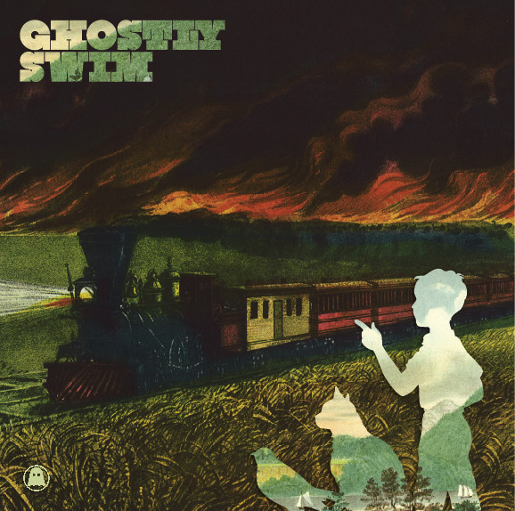
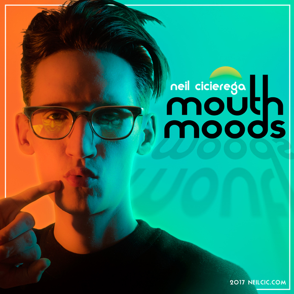
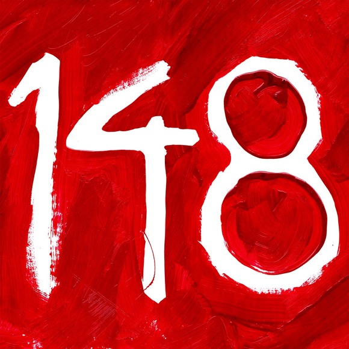
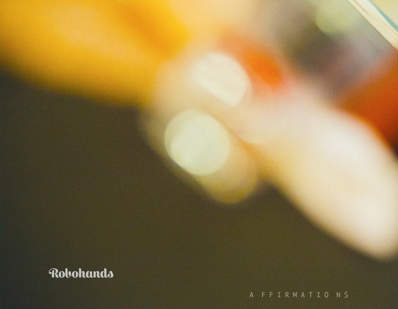
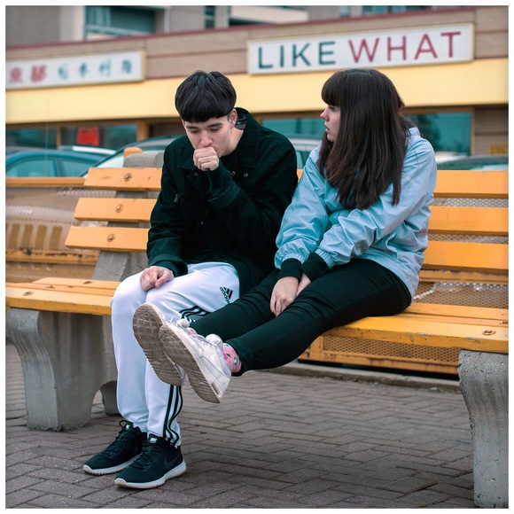

+++
title = "Five Free of Charge Albums You Should Absolutely Listen to"
author = "Micah Bird"
date = "2026-04-03"
categories = [
    "Music"
]
image = "cover.jpg"
+++

The following a short compilation of albums that can be *legally* downloaded from an official source, be that directly from the artist or publisher itself. Whether you are just starting a local music library, or already have terabytes of music, I think all of these would make great additions to your collection! After all, who doesn't like free?!

## Various Artists - Ghostly Swim

A phenomenal electronic album, where each song is from a different artist. Even if you are not a electronic music fan, I am willing to bet that you can find at least one track that you enjoy, due to sheer sonic diversity at play here. This album is positively blooming with early 2000s nostalgia energy. In fact, I discovered a lot of my favorite artists from this album, such as [Tycho](https://tycho.bandcamp.com/album/past-is-prologue) and [Mux Mool](https://muxmool.bandcamp.com/album/skulltaste). I only wish that Ghostly International and Adult Swim could pull off another phenomenal album like this.
**Memorable Track: Tycho - Cascade (Live)**

**[Download from Ghostly International](https://www.adultswim.com/music/ghostly-swim)**

## Neil Cicierega - Mouth Moods 

This album is absolutely not for everyone, but if you jive with off-the-wall remixes and sampling like I do, then you will no doubt enjoy this album. The sheer amount of pop-culture references and songs reimagined on this album is staggering. The more blind you can go into this one, the better.

**Memorable Track: Wow Wow**

**[Download from Neil Cicierega's Website](http://www.neilcic.com/mouthmoods/)**

*(Shame for not having your HTTPs certs up to date Neil...)*

## C418 - 148

I'm going to be honest, this is probably the most mixed bag album on this list. There are some tracks that are pretty annoying, bordering on grating to listen to. Especially the first 3 tracks, which just use a kinda reuse a pretty mediocre vocal sample. But, holy cow, when a song hits, they are BANGERS. What is even cooler is that there are DJ-able remixes of Minecraft Soundtrack songs, and they are just \*chef's kiss\*! If you are even familiar with the music in Minecraft, at the very least, listen to **Beta** and you will see what I mean.

**Memorable Track: Beta**

**[Download from C418's Bandcamp](https://c418.bandcamp.com/album/148)**

## Robohands - Affirmations

This is probably the most chill, laid back jazz, and shortest album on this list. This was how I was introduced to Robohands, and have been listing to them ever since! I am a sucker for any kind of music that has a [Rhodes piano](https://en.wikipedia.org/wiki/Rhodes_piano) involved, so this is always a joy to listen to.

**Memorable Track: Into The Darkness**

**[Download from Robohand's Bandcamp](https://robohands.bandcamp.com/album/affirmations)**

## Tennyson - Like What EP

Admittedly this is kinda cheating since this is an EP, but it's an absolute no-brainer for any electronica/low-fi/chill music enjoyer. This EP always manages to put a smile on my face. The vocals on the few tracks that they are present work in so organically that it's just bliss, on top of every track being the perfect length. You can tell that Tennyson just had fun with the track "L'oiseau qui danse".

**Memorable Track:** Like What?

**[Download from Tennyson's Bandcamp](https://tennyson.bandcamp.com/album/like-what-ep)**

# More in the Future?

Hopefully in the near future I will be making a dedicated site for these kinds of free album recommendations! Pester me in the comments and I'll get it done sooner, and/or recommend an album, I'm all ears!

