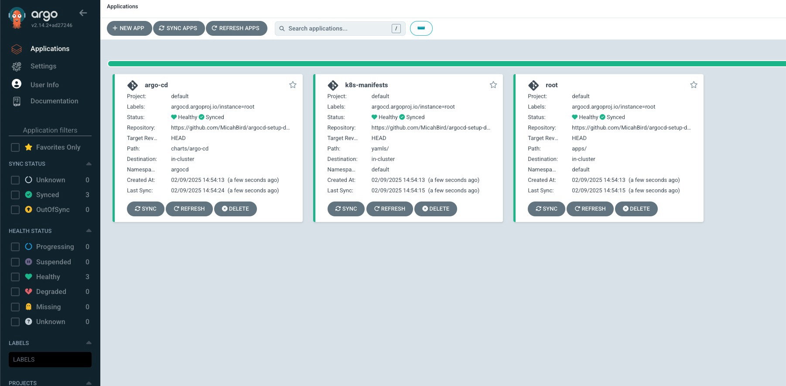
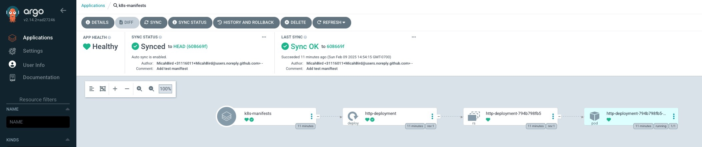

+++
title = "How to Setup ArgoCD (the Homelab Way)"
author = "Micah Bird"
date = "2025-02-09"
categories = [
    "DevOps",
    "Kubernetes"
]
image = "cover.jpg"
+++

## Preamble

Manage a Kubernetes cluster for your homelab? Tired of mucking around with`kubectl apply -f` and `helm install` commands, and wish your deployments were more declarative, reproducible, and controlled with Git? Well, ArgoCD is the solution for you! This tutorial will go through setting up ArgoCD from scratch, and even how you setup a cluster with a single command! Make sure that you already have `helm` and `kubectl` installed, and `kubectl` can connect to your cluster before proceeding!


## Folder structure

First, initialize a git repo with the following directories and familiarize yourself with each of their purposes:
```sh
mkdir -p apps/templates
mkdir -p yamls
mkdir -p charts/argo-cd
```

- `apps` is where all of your Helm deployments will live, along with the 'root' app for your K8s manifests, more on that later.
- `charts` is how ArgoCD is bootstrapped and declared for the cluster.
- `yamls` is where all of your desired K8s manifests will be deployed from.


## Bootstrapping ArgoCD

Start by adding the Argo Helm repo with the following command:
```sh
helm repo add argo https://argoproj.github.io/argo-helm
```

Then by placing the following contents in a yaml file located at `charts/argo-cd/Chart.yaml`, we can generate a Chart.lock file for managing ArgoCD's version:
```yaml
apiVersion: v2
name: argo-cd
version: 1.0.0
dependencies:
  - name: argo-cd
    version: 7.8.2
    repository: https://argoproj.github.io/argo-helm
```
NOTE: To check what the latest version is, use the command `helm search repo -l | grep argo-cd`.

With that `Chart.yaml` in place, now run following command to *lock in* that version:
```sh
helm dep update charts/argo-cd/
```

## Setup the Github Repository

Now, create a private Github repo, and create a [fine-grained personal access token](https://github.com/settings/personal-access-tokens/new) for it. For the personal access token, set no expiry date, and select access only to you repo you just created. With your newfound token, fill in the following K8s secret manifest, and for ArgoCD will utilize that token to pull from your repo. Put this secret somewhere safe!
```yaml
apiVersion: v1
kind: Secret
metadata:
  name: deployment-git-repo
  namespace: argocd
  labels:
    argocd.argoproj.io/secret-type: repository
stringData:
  type: git
  url: https://github.com/[GITHUB_REPO_HERE]
  username: [GITHUB_USERNAME_HERE]
  password: [GITHUB_PAT_HERE]
```

Be sure to apply this secret!
```sh
kubectl create ns argocd
kubectl apply -f secret-argocd-git-repo-credentials.yaml
```

## Installing ArgoCD

Now comes the fun part, actually installing ArgoCD, but first we got to set the scene:

We need to create a 'root' [Application](https://argo-cd.readthedocs.io/en/stable/core_concepts/) for ArgoCD to springboard off of, place the following file in `apps/Chart.yaml`

```yaml
apiVersion: v2
name: root
version: 1.0.0
```

As well as place this `Application` manifest for `root` in `apps/templates/root.yaml`
```yaml
apiVersion: argoproj.io/v1alpha1
kind: Application
metadata:
  name: root
  namespace: argocd
  finalizers:
  - resources-finalizer.argocd.argoproj.io
spec:
  destination:
    server: https://kubernetes.default.svc
    namespace: default
  project: default
  source:
    path: apps/
    repoURL: https://github.com/[GITHUB_REPO_HERE].git
    targetRevision: HEAD
  syncPolicy:
    automated:
      prune: true
      allowEmpty: true
      selfHeal: true
```

With this root Application, ArgoCD will automatically deploy any manifests present in the `apps/templates/` folder! For example, we could deploy a Helm Chart like NGINX (**optionally** paste this file in `apps/templates/ingress-nginx.yaml`):

```yaml
apiVersion: argoproj.io/v1alpha1
kind: Application
metadata:
  name: ingress-nginx
  namespace: argocd
  finalizers:
  - resources-finalizer.argocd.argoproj.io
spec:
  destination:
    server: https://kubernetes.default.svc
    namespace: ingress
  project: default
  source:
    chart: ingress-nginx
    repoURL: https://kubernetes.github.io/ingress-nginx
    targetRevision: 4.11.1
    helm:
      parameters:
      - name: "contoller.service.loadBalancerIP"
        value: "192.168.1.2"
  syncPolicy:
    automated:
      prune: true
      selfHeal: true
```

We can also point ArgoCD at a folder in the Github repo to deploy K8s manifests from (paste the contents in `apps/templates/k8s-manifests.yaml`):
```yaml
apiVersion: argoproj.io/v1alpha1
kind: Application
metadata:
  name: k8s-manifests
  namespace: argocd
spec:
  destination:
    server: https://kubernetes.default.svc
    namespace: default
  project: default
  source:
    path: yamls/
    repoURL: https://github.com/[GITHUB_REPO_HERE].git
    targetRevision: HEAD
    directory:
      recurse: true
  syncPolicy:
    automated:
      prune: true
      selfHeal: true
  ignoreDifferences:
  - group: apps
    kind: Deployment
    jsonPointers:
    - /spec/replicas
```

On top of that, we can allow ArgoCD to manage also itself with the following Application (paste the contents in `apps/templates/argo-cd.yaml`):
```yaml
apiVersion: argoproj.io/v1alpha1
kind: Application
metadata:
  name: argo-cd
  namespace: argocd
  finalizers:
  - resources-finalizer.argocd.argoproj.io
spec:
  destination:
    server: https://kubernetes.default.svc
    namespace: argocd
  project: default
  source:
    path: charts/argo-cd
    repoURL: https://github.com/[GITHUB_REPO_HERE].git
    targetRevision: HEAD
  syncPolicy:
    automated:
      prune: true
      selfHeal: true
```

Finally, ensure everything is up to date in your Github Repo, and deploy ArgoCD!
```sh
git add . 
git commit -m 'Getting Started!'
git push

helm install -n argocd argo-cd charts/argo-cd/
```

## Deploy Your First Manifest Via Git

If you take a look at the pods present in the `argocd` namespace, there should now be a plethora of pods present and running! Now check in and ensure everything went smoothly by logging into the ArgoCD Admin Panel:
```bash
# Delpoy your `apps/` for the first time (you only have to do this once)
helm template apps/helm template apps/ | kubectl apply -f -

# Get the admin password for the WebUI (if this doesn't return anything run it in bash ;)
kubectl get secret -n argocd argocd-initial-admin-secret --template={{.data.password}} | base64 --decode

# Port Forward the WebUI
kubectl port-forward -n argocd service/argo-cd-argocd-server 8080:443
```

Then go to [localhost:8080](https://localhost:8080) and login with the user `admin` and the admin password from the previous step.



Now that ArgoCD is running, let's put it to the test by deploying something without `kubectl`. Paste the following file into `yamls/test.yaml`:
```yaml
apiVersion: apps/v1
kind: Deployment
metadata:
  name: http-deployment
  labels:
    app: http
spec:
  replicas: 1
  strategy:
        type: RollingUpdate
        rollingUpdate:
           maxSurge: 1
  selector:
     matchLabels:
       app: http
  template:
    metadata:
      labels:
        app: http

    spec:
     containers:
        - name: http
          image: httpd
          imagePullPolicy: Always
          ports:
            - containerPort: 80
```

Then `git add . && git commit -m 'Added test yaml' && git push` that critter. After waiting for a brief moment, you will then notice in the ArgoCD WebUI that a new deployment is present, and a new pod has spawned!


---


You can now deploy all of your K8s manifests via Git, and bask in all the benefits of version control! Need to undo something you applied? Deploy a new service? Change a ConfigMap? Just make your changes, commit and push them, and you are off to the races!

On top of that, you can now deploy your cluster from scratch with a single command! For reference, the completed directory structure and files are [available on Github!](https://github.com/MicahBird/argocd-setup-demo) Enjoy!

### The Single Command

Apply your GitHub repo secret, then all you need to run is:

```sh
kubectl create ns argocd && helm install -n argocd argo-cd charts/argo-cd/ && helm template apps/ | kubectl apply -f -
```

