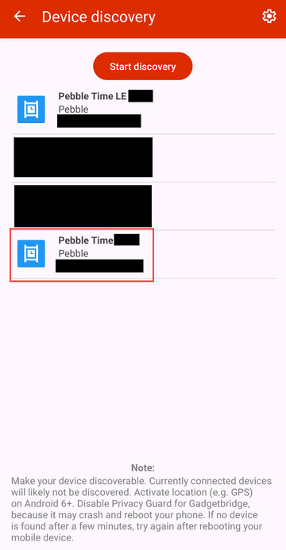
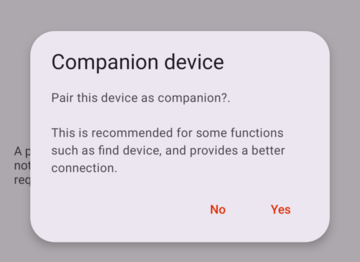
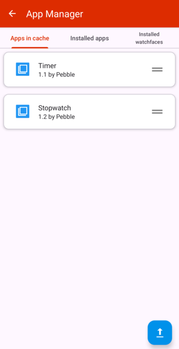

+++
title = "How to use Gadgetbridge with a Pebble watch"
author = "Micah Bird"
date = "2026-01-01"
categories = [
    "Pebble",
    "FOSS",
    "Android"
]
image = "cover.jpg"
+++

With all the hype surrounding the new Pebble devices, I thought it was high time that I share how I still rock my [Pebble Time](https://en.wikipedia.org/wiki/Pebble_Time) (*a device that released in 2015!*) to this day. The key, is [Gadgetbridge](https://gadgetbridge.org/).

## Why Gadgetbridge?

Although I haven't conducted any formal experiments or taken any measurements of battery life, anecdotally, I can say Gadgetbridge provides better battery life than the stock Pebble app. It also gives some peace of mind that the app is in constant development on top of being open source. Admittedly, this is also true of the [new Pebble app](https://repebble.com/app), but the landing page states that "Bluetooth connectivity to older Pebbles *may* be a bit flakey." so I have refrained from testing it for now. 

## Using Gadgetbridge with your Pebble Device

### Pre-Installtion Prep

If you want to be able to add any favorite contacts to the "Send Text" app, you most do so in the original Pebble app before switching to Gadgetbridge. After that:

1. Uninstall the Pebble app
2. Unpair the watch from your phone, and unpair your phone from your watch settings

### Pair your watch with Gadgetbridge

Install the [Gadgetbridge app](https://f-droid.org/packages/nodomain.freeyourgadget.gadgetbridge/) from a repository of your choosing, then add a device:

**Note that you must pair the device with the non-LE connection.** It may take a while for the normal Bluetooth device to show up. Be patient.

If after multiple attempts the non-LE Bluetooth device doesn't show up, exit the Gadgetbridge app, force stop the app, turn off Bluetooth, turn on airplane mode, turn Bluetooth back on, and then go back to the gadget bridge app and try again.

Upon connecting, select "No" when asked to pair it as a companion device.

Then be *very* patient as it pairs, it took multiple minutes for my Pebble Time to pair. Maybe take a gander at my [Tech Talks Hall of Fame](/tech-talks-hall-of-fame/) while waiting, or not, I don't mind either way.

### Profit!

To test that your Pebble device is successfully paired, now try to send a test notification by pressing the menu button in the upper left corner > Debug > Send. If you receive "Test" on your watch, congrats!

## Installing Apps from the Rebble store 

After using Gadgetbridge for a while, it dawned on me I was missing a stopwatch app. As it would turn out, it's possible to install apps on your Pebble device via Gadgetbridge, although obtaining said watch apps is a bit obfuscated.

To install apps, you have to download them as `.pbw` files to then upload in Gadgetbridge app. To obtain said mystical files, you have to go to the [Rebble App Store with developer settings enabled](https://apps.rebble.io/en_US/watchapps?dev_settings=true) or simply append `?dev_settings=true` to the end of a URL to the app, for example, the stopwatch app would be [`https://apps.rebble.io/en_US/application/55b6c2c3e68f5acdfc00008d?dev_settings=true`](https://apps.rebble.io/en_US/application/55b6c2c3e68f5acdfc00008d?dev_settings=true)

Then at the bottom of the page of the app, tap the "Download PBW" link, save the file, and then in Gadgetbridge select the App Manager of your Pebble device, and upload the app using the button in the lower right:

Enjoy, and a hardy thanks to the [people who make Gadgetbridge](https://codeberg.org/Freeyourgadget/Gadgetbridge/src/branch/master/CONTRIBUTORS.rst), a truly incredible piece of software!
