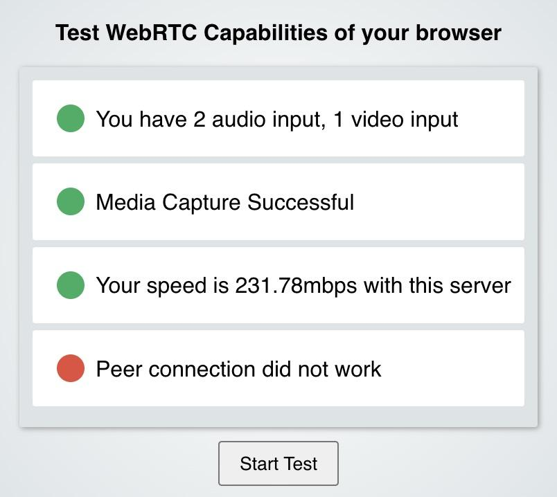
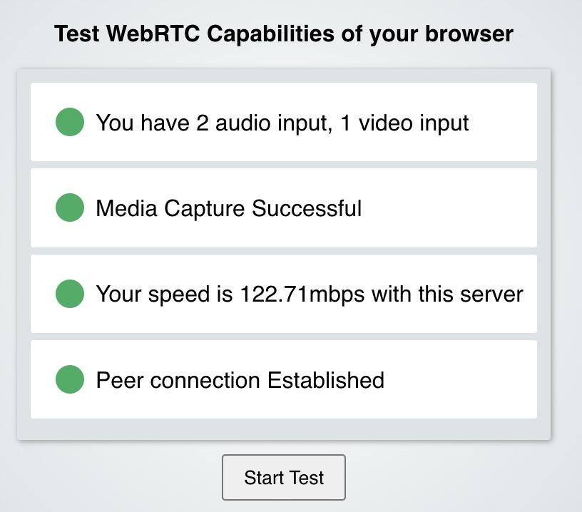

+++
title = "How to fix WebRTC connection issues on Ungoogled Chromium"
author = "Micah Bird"
date = "2023-08-09"
categories = [
    "Chrome",
    "Webdev"
]
image = "cover.jpg"
+++

## Preamble

I noticed that when updating [Ungoogled Chromium](https://github.com/ungoogled-software/ungoogled-chromium), seemingly randomly WebRTC would stop working and as a result apps like Discord would fail to connect when joining voice calls. Searching online didn't yield any similar issues, but after some hunting in `chrome://flags/`, I found a fix!

## Testing WebRTC

First, make sure that indeed your WebRTC isn't working and not some odd fluke, [by using this test suite](https://theanam.github.io/webrtc-test-suite/), it should show the "Peer connection did not work" error:

## The Fix

Simply go to `chrome://flags/#webrtc-ip-handling-policy` and change the value from `Disable non proxied udp` to `Default`, relaunch chromium, and run the WebRTC test suite again. You should see that WebRTC is working now!

Hopefully this guide helped you and leave a comment if you have any feedback!

The version of Chrome that I tested this fix on is `115.0.5790.170 (Official Build, ungoogled-chromium) (arm64)`
